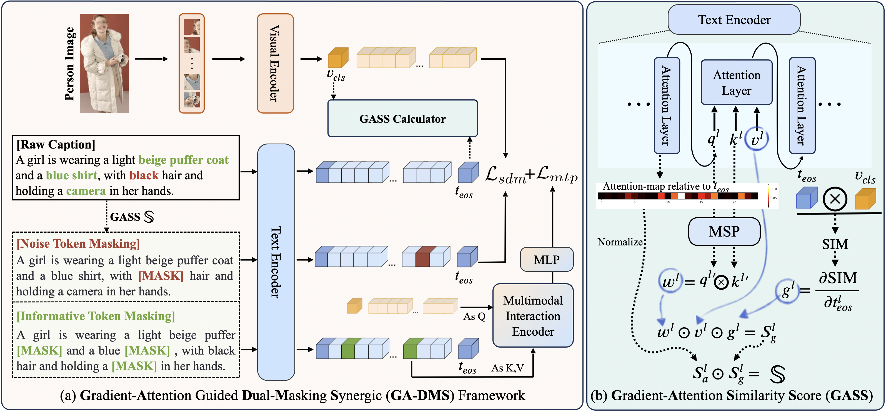
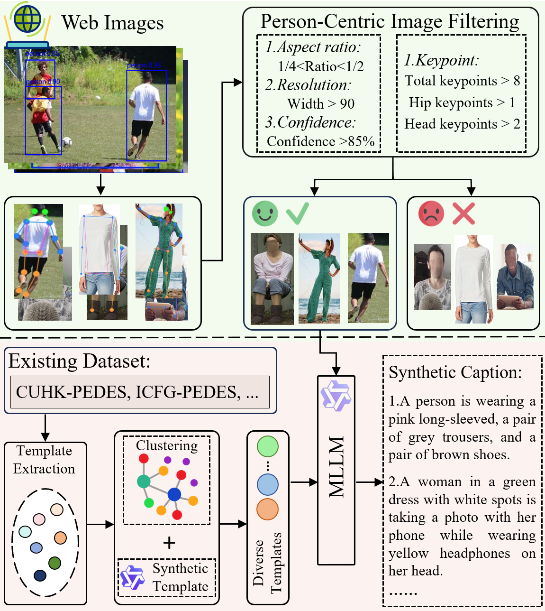

# [EMNLP 2025] Gradient-Attention Guided Dual-Masking Synergetic Framework for Robust Text-based Person Retrieval


> **[Gradient-Attention Guided Dual-Masking Synergetic Framework for Robust Text-based Person Retrieval](https://github.com/xiaolu-luu/GA-DMS)** <br>
<a href="https://github.com/xiaolu-luu/GA-DMS">Tianlu Zheng</a>,</span>
<a href="https://github.com/BlueSocksFFF">Yifan Zhang,</span>
<a href="https://github.com/anxiangsir">Xiang An</a>,</span>
Ziyong Feng,</span>
<a href="https://kaicheng-yang0828.github.io">Kaicheng Yang</a>,</span>
Qichuan Ding,</span>

## 💡 Highlights
This work advances CLIP for person representation learning through synergistic improvements in data curation and model architecture. First, we develop a noise-resistant data construction pipeline that leverages the in-context learning capabilities of MLLMs to automatically filter and caption web-sourced images. This yields **WebPerson**, a large-scale dataset of 5M high-quality person-centric image-text pairs. Second, we introduce the **GA-DMS** (**G**radient-**A**ttention Guided **D**ual-**M**asking **S**ynergetic) framework, which improves cross-modal alignment by adaptively masking noisy textual tokens based on the gradient-attention similarity score. Additionally, we incorporate masked token prediction objectives that compel the model to predict informative text tokens, enhancing fine-grained semantic representation learning. Extensive experiments show that GA-DMS achieves state-of-the-art performance across multiple benchmarks. 

<div style="text-align: center;">
    
</div>

we utilize the [COYO700M](https://github.com/kakaobrain/coyo-dataset) dataset, a large-scale dataset that contains 747M image-text pairs collected from CommonCrawl, as our web-crawled images source. The following is the details of person-centric image filtering and synthetic caption generation pipeline for constructing our WebPerson dataset.


<center>
    
</center>

## WebPerson Dataset
The WebPerson dataset can be downloaded [here](https://huggingface.co/datasets/Kaichengalex/WebPerson-5M), which includes both 5M and 1M scales. Both the images and their corresponding textual descriptions are available from this source.

## Prepare Downstream Datasets
Download the CUHK-PEDES dataset from [here](https://github.com/ShuangLI59/Person-Search-with-Natural-Language-Description), ICFG-PEDES dataset from [here](https://github.com/zifyloo/SSAN) and RSTPReid dataset form [here](https://github.com/NjtechCVLab/RSTPReid-Dataset).

## Environment installation
```bash
conda create -n ga_dms python=3.10 -y
conda activate ga_dms

pip install torch==2.1.2 torchvision==0.16.2 torchaudio==2.1.2 --index-url https://download.pytorch.org/whl/cu118
pip install -r requirements.txt
```

## Pretrain Model Checkpoints
We release the Pretrain Model Checkpoints [here](https://github.com/xiaolu-luu/GA-DMS). \
To fine-tune model, you can simply run ```sh finetune.sh --finetune checkpoint.pth```. After the model training is completed, it will provide the performance of fine-tune setting.

## Acknowledgements
This project is based on [MLLM4Text-ReID](https://github.com/WentaoTan/MLLM4Text-ReID), and [IRRA](https://github.com/anosorae/IRRA), thanks for their works.

